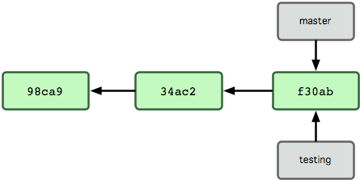

= id="intro"

# Curso de Git

<http://bit.ly/abrilcursogit>

<https://github.com/abril/git-course>

Baseado em <http://git-scm.com/book/pt-br>

<span style="color:#eee;">Navege com as setas</span>

---
= id="step1"

# Quem sou eu?

Celestino Ferreira Gomes

* <http://twitter.com/tinogomes>
* <http://github.com/tinogomes>
* <http://blog.tinogomes.com>

---
= id="step2"

# O que é?

* Criado em 2005 por Linus Torvalds*
* Necessidade, linux-kernel-devs
* Velocidade
* Design simples
* Suporte robusto a desenvolvimento não linear (milhares de branches paralelos)
* Totalmente distribuído
* Capaz de lidar eficientemente com grandes projetos como o kernel do Linux (velocidade e volume de dados)

---
= id="step3"

# Características Básicas

* Controle de versão distribuido (DVCS)
* Gerenciamento de conteúdo e não arquivos
* Branches como unidade de trabalho
* SHA1 para associação e verificação
* Staging index (preparação para *commit*)
<li style='color: #eee'>Não é o subversion</li>

---
= id="step4"

# Estrutura de Controle

* Diretório `.git` na raíz de cada projeto
* Arquivos de configuração `.git/config`
* Hooks `.git/hooks`
* Object Database `.git/objects`
* References `.git/refs`

---
= id="step5" data-rotate-x=90

# Estrutura de Controle

```
.git
|-- COMMIT_EDITMSG  # última mensagem de commit
|-- HEAD            # referência atual do checkout
|-- config          # arquivo de configuração do repositório
|-- description     # arquivo de descrição do repositório
|-- hooks           # diretório com arquivos de gatilhos
|   |-- ...
|-- index           # mudanças para commit
|-- info
|   |-- exclude     # configuração de arquivos p/ ñ versionamento
|   +-- refs        # lista de branches e suas referências
|-- logs
|   |-- ...         # arquivos de log das mudanças
|-- objects
|   |-- info
|   │   +-- packs   # informações sobre pacotes
|   +-- pack
|       |-- ...     # pacotes e indices
|-- packed-refs
|-- refs
    |-- heads
    +-- tags
```

---
= id="step6"

# Objects Database

Todos os objetos se registram da mesma forma.

```
conteudo

header + conteudo

"2e6f9b0d5885b6010f9167787445617f553a735f"

zlib(header + conteudo)

```
`.git/objects/2e/6f9b0d5885b6010f9167787445617f553a735f`

---
= id="step7" data-rotate-x=90

# Objects Database

```ruby
def put_raw_object(content, type)
  size = content.length.to_s
  LooseStorage.verify_header(type, size)

  header = "#{type} #{size}\0"
  store = header + content

  sha1 = Digest::SHA1.hexdigest(store)
  path = @directory + '/' + sha1[0...2] + '/' + sha1[2..40]

  if !File.exists?(path)
    content = data - scale = 2Zlib::Deflate.deflate(store)

    FileUtils.mkdir_p(@directory+'/'+sha1[0...2])
    File.open(path, 'wb') do |f|
      f.write content
    end
  end
  return sha1
end
```

<div class='note'>
    <a href='https://github.com/mojombo/grit/blob/b49a6ff4ccd169eef6671263ccb29d3ead957697/lib/grit/git-ruby/internal/loose.rb#L89-L106'>Extraído do Grit</a>
</div>


---
= id="step8"

# Objects Database

* blob - É o menor objeto git e representa um arquivo.
* tree - É um container de *trees* e *blobs*
* commit - É um "snapshot" do estado atual de uma *tree*
* tag - aponta para um *commit*

<table class='objeto'>
    <thead>
        <tr>
            <td>type</td>
            <td>size</td>
        </tr>
    </thead>
    <tbody>
        <tr>
            <td colspan='2'>data</td>
        </tr>
    </tbody>
</table>

---
= id="step9"

# Objects Database

## blobs

<div class='list blobs'>
    <ul class='keys'>
        <li>Rakefile</li>
        <li>source.rb</li>
        <li>source_test.rb</li>
    </ul>
    <ul class='values'>
        <li class='blob'>blob: 2e6f9b</li>
        <li class='blob'>blob: 7034fe</li>
        <li class='blob'>blob: 8034f1</li>
    </ul>
</div>

<table class='objeto'>
    <thead>
        <tr>
            <td>blob</td>
            <td>size</td>
        </tr>
    </thead>
    <tbody>
        <tr class='data'>
            <td colspan='2'>file data</td>
        </tr>
    </tbody>
</table>

`2e6f9b0d5885b6010f9167787445617f553a735f`

---
= id="step10"

# Objects Database

## trees

<div class='list trees'>
    <ul class='keys'>
        <li>/</li>
        <li>Rakefile</li>
        <li>/lib</li>
        <li>source.rb</li>
        <li>/test</li>
        <li>source_test.rb</li>
    </ul>
    <ul class='values tree-container'>
        <li class='tree'>tree: 1a2b3c</li>
        <li class='blob'>blob: 2e6f9b</li>
        <li class='tree'>tree: 2b3c4d</li>
        <li class='blob'>blob: 7034fe</li>
        <li class='tree'>tree: 5b32ad</li>
        <li class='blob'>blob: 8034f1</li>
    </ul>
</div>

<table class='objeto'>
    <thead>
        <tr>
            <td>tree</td>
            <td>size</td>
        </tr>
    </thead>
    <tbody>
        <tr>
            <td colspan='2'>
                040000 tree 1a2b3c... /<br/>
                100644 blog 2e6f9b... Rakefile<br/>
                ...
            </td>
        </tr>
    </tbody>
</table>

`ob772ec8eb9ae8952c3c1e56a9ffbe49385cc83a`

---
= id="step11"

# Objects Database

## commits (snapshots)

<div class='list commits'>
    <ul class='keys'>
        <li>&nbsp;</li>
        <li>/</li>
        <li>Rakefile</li>
        <li>/lib</li>
        <li>source.rb</li>
        <li>/test</li>
        <li>source_test.rb</li>
    </ul>
    <ul class='values tree-container'>
        <li class='commit'>commit: 3e4c5d</li>
        <div class="tree-container">
            <li class='tree'>tree: 1a2b3c</li>
            <li class='blob'>blob: 2e6f9b</li>
            <li class='tree'>tree: 2b3c4d</li>
            <li class='blob'>blob: 7034fe</li>
            <li class='tree'>tree: 5b32ad</li>
            <li class='blob'>blob: 8034f1</li>
        </div>
    </ul>
</div>

<table class='objeto'>
    <thead>
        <tr>
            <td>commit</td>
            <td>size</td>
        </tr>
    </thead>
    <tbody>
        <tr class='data'>
            <td colspan='2'>
                tree ob772e...<br/>
                parent 12cb23...<br/>
                author Someone &lt;aliress&gt;<br/>
                commiter Someone &lt;aliress&gt;<br/>
                commit message<br/>
                ...
            </td>
        </tr>
    </tbody>
</table>

`7216b02627bc3d6ef57008f7ff67f0f8f13f488e`

---
= id="step12"

# Objects Database

## commits

<div class='only-commits'>
    <ul class='keys'>
        <li>&nbsp;</li>
        <li>/</li>
        <li class='file-changed'>Rakefile</li>
        <li>/lib</li>
        <li>source.rb</li>
        <li>/test</li>
        <li class='file-changed'>source_test.rb</li>
    </ul>
    <ul class='values tree-container'>
        <li class='commit'>commit: 3e4c5d</li>
        <div class="tree-container">
            <li class='tree'>tree: 1a2b3c</li>
            <li class='blob'>blob: 2e6f9b</li>
            <li class='tree'>tree: 2b3c4d</li>
            <li class='blob'>blob: 7034fe</li>
            <li class='tree'>tree: 5b32ad</li>
            <li class='blob'>blob: 8034f1</li>
        </div>
    </ul>
    <ul class='values tree-container'>
        <li class='commit'>commit: 61db26</li>
        <div class="tree-container">
            <li class='tree'>tree: 1a2b3c</li>
            <li class='blob-changed'>blob: 41d300</li>
            <li class='tree'>tree: 2b3c4d</li>
            <li class='blob'>blob: 7034fe</li>
            <li class='tree'>tree: 5b32ad</li>
            <li class='blob-changed'>blob: 2a03fb</li>
        </div>
    </ul>
</div>

---
= id="step13"

# Objects Database

## tags

<div class='list tags'>
    <ul class='keys'>
        <li>&nbsp;</li>
        <li>&nbsp;</li>
        <li>/</li>
        <li>Rakefile</li>
        <li>/lib</li>
        <li>source.rb</li>
        <li>/test</li>
        <li>source_test.rb</li>
    </ul>
    <ul class='values'>
        <li class='tag'>tag: 6e7a8b</li>
        <div class="tree-container">
            <li class='commit'>commit: 3e4c5d</li>
            <div class="tree-container">
                <li class='tree'>tree: 1a2b3c</li>
                <li class='blob'>blob: 2e6f9b</li>
                <li class='tree'>tree: 2b3c4d</li>
                <li class='blob'>blob: 7034fe</li>
                <li class='tree'>tree: 5b32ad</li>
                <li class='blob'>blob: 8034f1</li>
            </div>
        </div>
    </ul>
</div>

<table class='objeto'>
    <thead>
        <tr>
            <td>tag</td>
            <td>size</td>
        </tr>
    </thead>
    <tbody>
        <tr class='data'>
            <td colspan='2'>
                object 7216b0...<br/>
                tag tag-name<br/>
                ...
            </td>
        </tr>
    </tbody>
</table>

`0bc9a42eb66d7ae36bf44af8ff5a3888e8a02d12`

---
= id="step14"

# Instalação

Acessar o site oficial do Git e fazer o download de acordo com seu sistema operacional.

<http://git-scm.com/downloads>

---
= id="step15"

# Obtendo ajuda

```bash
$ git help

usage: git &lt;command&gt; [&lt;args&gt;]

The most commonly used git commands are:
   add        Add file contents to the index
   bisect     Find by binary search the change that introduced a bug
   branch     List, create, or delete branches
   checkout   Checkout a branch or paths to the working tree
   clone      Clone a repository into a new directory
   ...
   tag        Create, list, delete or verify a tag object signed with GPG

See 'git help &lt;command&gt;' for more information on a specific command.
```

---
= id="step16"

# Configurando

Sintaxe:

`$ git config [&lt;options&gt;] [&lt;key&gt; &lt;value&gt;]`

1. Sistema `--system`: `/etc/gitconfig`

    ```bash
    $ git config --system
    ```

2. Global `--global`: `~/.gitconfig`

    ```bash
    $ git config --global user.name "Celestino Gomes"
    $ git config --global user.email "celestino.gomes@abril.com.br"
    ```

3. Repositório `--local`: `./.git/config` Esse somente em um repositório ;)

    ```bash
    $ git config [--local] core.ignorecase true
    ```

```bash
$ git config user.name   # Imprime "Celestino Gomes"
$ git config --list      # Lista as chaves configuradas para o repo atual
```

---
= id="step17"

# O Básico

## Criando um repositório local.

1. `git init`: Cria um repositório a partir do diretório atual.

2. `git clone`: Cria um repositório a partir de um outro repositório já existente.

    ```bash
    $ cd repos
    $ git clone https://github.com/abril/git-course.git
    ```

    ```bash
    $ cd repos
    $ git clone https://github.com/abril/git-course.git curso-de-git
    ```

---
= id="step18"

# O Básico

## Gravando as mudanças no repositório.

Abaixo uma imagem que explica o ciclo de vida dos arquivos em um repositório *git*.


---
= id="step19"

# O Básico

## Verificando o estado dos seus arquivos

```bash
$ git status
# On branch master
nothing to commit (working directory clean)

$ echo 'conteudo' > README
$ git status
# On branch master
# Untracked files:
#   (use "git add <file>..." to include in what will be committed)
#
#    README
nothing added to commit but untracked files present (use "git add" to track)
```

---
= id="step20"

# O Básico

## Preparando suas mudanças para integração

`git add &lt;path&gt;`

Exemplo:

`$ git add README`

---
= id="step21"

# O Básico

## Verificando o estado dos seus arquivos II

```bash
$ git status
# On branch master
#
# Initial commit
#
# Changes to be committed:
#   (use "git rm --cached <file>..." to unstage)
#
#	new file:   README
#
```

---
= id="step22"

# O Básico

## Ignorando Arquivos

`$ cat .gitignore`

É comum usar para ignorar arquivos temporários, log e configurações locais.

`$ echo '*.log' >> .gitignore`

---
= id="step23"

# O Básico

## Visualizando suas modificações (selecionadas ou não)

`git diff [--cached] [[--] &lt;path&gt;]`

Exemplo:

```bash
$ git diff
diff --git a/README b/README
index 0cfbf08..bcaa3b0 100644
--- a/README
+++ b/README
@@ -1 +1,2 @@
 2
+conteudo
```

---
= id="step24"

# O Básico

## Fazendo *commit* de suas mudanças

`git commit [&lt;options&gt;]`

* `-m` - mensagem de commit
* `-a` - inclui todos as mudanças de conteúdo

`$ git commit -m 'meu primeiro commit no git \o/'`

Se não passar `-m` com uma mensagem, o `git commit` vai abrir o editor padrão configurado para o sistema.

`git config --global core.editor vi`


---
= id="step25"

# O Básico

## Removendo arquivos

`git rm [-r] &lt;path&gt;`

## Movendo arquivos

`git mv &lt;current_path&gt; &lt;new_path&gt;`

Exemplo

`$ git mv README LEAIAME`

É a mesma coisa que:

```
$ mv README LEIAME
$ git rm README
$ git add LEIAME
```

---
= id="step26"

# O Básico

## Visualizando o Histórico de commits

`git log [&lt;options&gt;] [&lt;since&gt;..&lt;until&gt;] [[--] &lt;path&gt;...]`

* `-&lt;N&gt;` - Para listar os N últimos commits.
* `--pretty=&lt;format&gt;` - Formato de apresentação dos commit, podendo ser: oneline, short, medium (default), full, fuller, email, raw e formato definido pelo usuário.
* `--graph` - Imprime de formato "gráfico" os commits

`$ git log --oneline --graph`

## O que tem em um commit?

`git show &lt;commit&gt;`

---
= id="step27"

# O Básico

## Modificando seu último commit

`git commit --amend`

**Use apenas em seu repositório local, antes de integrar com outros repos**

## Tirando um arquivo da área de seleção

`$ git reset HEAD`

## Desfazendo um arquivo modificado

`$ git checkout -- arquivo`

---
= id="step28"

# O Básico

## Fluxo completo

```bash
$ git init # git clone &lt;repo&gt;
$ git add .
$ git commit -m 'Primeiro commit'
```

## Sugestão de atalhos

```
git config --global alias.st 'status'
git config --global alias.one 'log --oneline'
git config --global alias.oneg 'log --oneline --graph'
git config --global alias.ci 'commit'
git config --global alias.cim 'commit -m'
```

---
= id="step29"

#  Branches

No *git*, estamos sempre trabalhando em um *branch*. O nome do *branch* padrão é o **master**. Mas o que é um branch no git?

```bash
$ git branch
* master
```

O branch é nada mais que uma referência (ponteiro) móvel para um commit. Logo:


---
= id="step30"

# Branches

`$ git branch testing` vai criar um novo branch, apontando para a referência atual.



---
= id="step31"

# Branches

Como o git sabe o branch em que você está atualmente? Ele tem um ponteiro especial chamado **HEAD**.


---
= id="step32"

# Branches

Para mudar de branch, use `git checkout &lt;branch-name&gt;`

`$ git checkout testing`


---
= id="step33"

# Branches

Como juntar as coisas? Existem duas estratégia, sendo elas **merge** ou **rebase**

## Branch Merge

`$ git merge &lt;commit&gt;`


---
= id="step34"

# Branches

## Branch Merge

```bash
$ git checkout -b iss53
$ git add .
$ git commit -m 'c3'
$ git add .
$ git commit -m 'c5'
# ------------------
$ git checkout master
$ git add .
$ git commit -m 'c4'
$ git merge iss53
```

---
= id="step35"

# Branches

## Branch Rebase `git rebase &lt;base&gt; &lt;destino&gt;`


<br/>

```bash
$ git checkout -b experiment
$ git add .
$ git commit -m 'c3'
# ------------------
$ git checkout master
$ git add .
$ git commit -m 'c4'
# ------------------
$ git checkout experiment
$ git rebase master
```

---
= id="step36"

# Branches

## Branch Rebase

Então é só fazer a atualização do master para o experiment.

```bash
$ git checkout master
$ git merge experiment
```
<br/>


---
= id="step37" data-rotate-x=90

# Branches

## Sugestão de atalhos

```
git config --global alias.br 'branch'
git config --global alias.co 'checkout'
git config --global alias.rb 'rebase'
git config --global alias.rbc 'rebase --continue'
git config --global alias.rbs 'rebase --skip'
git config --global alias.rba 'rebase --abort'
```

---
= id="step38"

# Tags

Para listas as tags existes 

`git tag`

Para criar uma nova tag

`git tag &lt;tagname&gt; &lt;commit&gt;`

---
= id="step39"

# Branches Remotos

São referências ao estado de seus branches no seu repositório remoto. Quando se cria um repositório através do comando `git clone`, nosso repositório fica com uma referência para este repositório remoto, e é identificado pela chave **origin**.

```bash
$ cd ~/curso
$ git clone ~/curso/repo-remoto celestino
$ cd meu-repo
$ git remote -v
origin ~/curso/repo-remoto (fetch)
origin ~/curso/repo-remoto (push)
```

---
= id="step40" data-rotate-x=90

# Branches Remotos


---
= id="step41"

# Branches Remotos

Para adicionar um repositório remoto ao seu repositório local, use:

`git remote add &lt;name&gt; &lt;repositorio&gt;`

Exemplo:

```bash
$ cd ~/curso
$ mkdir joao ; cd joao
$ git init
$ git remote add celestino ~/meu-repo
```

---
= id="step42"

# Branches Remotos

## Atualizando as referências

Antes de integrar com um branch remoto, é **muito** importante atualizar as referências remotas de nosso repositório.

`git fetch &lt;repo&gt;`

---
= id="step43" data-rotate-x=90

# Branches Remotos


---
= id="step44"

# Branches Remotos

## Integrando os branches

Tá, mas como eu integro os branches?

`git merge &lt;repo/branch&gt;`

Ah, então, seu eu quero atualizar meu master com o remoto...

`git merge origin/master` ou `git rebase origin/master`


---
= id="step45"

# Branches Remotos

## Integrando os branches II

A atualização do seu branch com o remoto pode ser mais fácil. `git pull &lt;repo&gt; &lt;branch&gt;`

`git pull` == `git fetch origin; git merge origin/master`

Tá, mas eu prefiro fazer rebase.

`git pull --rebase` = `git fetch origin; git rebase origin/master`

:)

--- 
= id="step46"

# Branches Remotos

Quero trabalhar em um branch remoto, como faz?

`git checkout -b &lt;branch-local&gt; &lt;repo&gt;/&lt;branch-remoto&gt;`

Exemplo:

```bash
$ git checkout -b fix origin/fix
Branch fix set up to track remote branch origin/fix.
Switched to a new branch "fix"
$ git branch
master
* fix
```

---
= id="step47"

# Branches Remotos

## Enviando para o servidor

`git push &lt;repo&gt; [&lt;branch-origem&gt;:]&lt;branch-destino&gt;`

`$ git push origin master`

Se seu branch está "seguindo (tracking)" um branch remoto...

`$ git push`

Quando se faz um clone, normalmente seu branch `master` local está seguindo o `origin/master`

---
= id="step48"

# Branches Remotos

## Apagando branches remotos

`git push &lt;repo&gt; :&lt;branch-destino&gt;`

Sim, é um *push*, porém o `branch-origem` é **NADA**, ele apaga o branch no repositório remoto.

---
= id="step49"

# Tags Remotas

Assim como os branches, sempre é necessário atualizar as referências das tags

`git fetch --tags`

Para enviar uma tag criada no repositório local para o remoto.

`git push origin &lt;tagname&gt;` 

Para enviar todas as tags locais

`git push origin --tags`


---
= id="step50"

# Fazendo Stash

*Stash* é um "branch local" do git que você pode colocar suas mudanças do seu diretório de trabalho, sem perder, e voltar seu branch para um estado estável. Funciona como uma pilha.

`git stash`

Listar os *stashes* disponíveis:

`git stash list`

---
= id="step51"

# Fazendo Stash

Para voltar as mudanças para seu diretório de trabalho.

`git stash apply [&lt;stash-index&gt;]`

Pode ser que, no momento de voltar seu trabalho do stash, o arquivo original não esteja no mesmo estado do seu conteúdo stashed, então, uma forma de tentar reaplicar as mudanças é adicionando a opção  `--index`

`git stash apply --index`

---
= id="step52"

# Fazendo Stash

Você pode remover um stash sem aplicar.

`git stash drop [&lt;stash-index&gt;]`

Você pode aplicar e remover um stash ao mesmo tempo.

`git stash pop [&lt;stash-index&gt;]`

Criar um branch do stash

`git stash branch &lt;nome-do-branch&gt;`

---
= id="step53"

# Ferramentas do Git

## Debugando

Pode ser que você precise descobrir quem escreveu aqui no arquivo.

`git blame &lt;commit-ref&gt;` [-L &lt;linhas_ou_regexp&gt;] &lt;arquivo&gt;

Exemplo:

```bash
$ git blame README
$ git blame -L 4,8 README
$ git blame -L 4,+5 README
$ git blame -L '/conteudo/',+5 README
$ git blame v1.0.. -- README
```

---
= id="step54"

# Ferramentas do Git

## Debugando II - Pesquisa Binária

Você precisa descobri em que ponto no histórico de *commits* algum bug foi introduzido

```bash
$ git log
$ git checkout &lt;commit-ref&gt;
# verificar se está ok ou não
$ git checkout &lt;commit-ref&gt;
# verificar se está ok ou não
$ git checkout &lt;commit-ref&gt;
# verificar se está ok ou não
...
```

O_o

---
= id="step55"

# Ferramentas do Git

## Debugando II - Pesquisa Binária

`git bisect start [&lt;bad-commit&gt;] [&lt;good-commit&gt;]`

Exemplo:

```bash
$ git log --oneline
        817a46d (HEAD, master) atualizando README
        28b3818 usando class com prefixo padrao
        ec466bb passando o numero da pagina atual
==&gt;     6a178b5 colocando link para obter mais comentarios
        1110218 rota para listar comentarios por pagina
        fb240bb paginando comentarios no model
        291b8ef (tag: v0.0.2-7) Merge branch 'master'
        638116b Configurando ambiente
$ git bisect start HEAD v0.0.2-7
Bisecting: 2 revisions left to test after this (roughly 2 steps)
[6a178b5...] colocando link para obter mais comentarios
```

---
= id="step56"

# Ferramentas do Git

## Debugando II - Pesquisa Binária

Declarar o estado do commit

`git bisect &lt;bad|good&gt;`

Voltar ao estado atual do branch

`git bisect reset`

Automático

`git bisect run &lt;script&gt;`

---
= id="step57"

# Resumão

## Basicão

```bash
git init  /  git clone &lt;repo_path&gt;
git config
git add &lt;path&gt;
git rm [-r] &lt;path&gt;
git mv &lt;current_path&gt; &lt;new_path&gt;
git commit [-m &lt;commit_message&gt;]
```

## Juntando os branches

```bash
git merge &lt;branch&gt;
git rebase &lt;branch&gt;
```

## Sincronizado com remoto

```bash
git fetch [&lt;repo&gt;]
git pull [&lt;repo&gt; [&lt;branch&gt;]] # == fetch + merge
git push [&lt;repo&gt; [&lt;local_branch&gt;][[:]&lt;remove_branch&gt;]]
```

---
= id="step58"

# Resumão

## Atalhos

```
git config --global alias.st 'status'
git config --global alias.one 'log --oneline'
git config --global alias.oneg 'log --oneline --graph'
git config --global alias.ci 'commit'
git config --global alias.cim 'commit -m'
git config --global alias.br 'branch'
git config --global alias.co 'checkout'
git config --global alias.rb 'rebase'
git config --global alias.rbc 'rebase --continue'
git config --global alias.rbs 'rebase --skip'
git config --global alias.rba 'rebase --abort'
```
